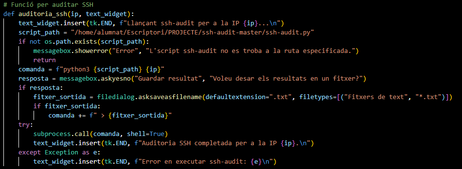

# Projecte-M14
### Fet per Adriana Cosma i Evelyn Nofuentes
# Index
- Preparació
  - [Anàlisi de riscos](#anàlisi-de-riscos)
- Fase de reconeixement
  - [Shodan](#Shodan)
  - [The Harvester](#the-Harvester)
  - [OSINT](#osint)
- Auditoria de serveis
  - [Escaneig](#escaneig)
  - [SSH](#ssh-audit)
  - [Enum4linux](#enum4linux)
- Funcionalitats afegides
  - [Bot Telegram amb Python](#bot-de-telegram)
  - [Docker](#docker)
- Enllaç a la documentació tecnica
  - [Documentació tecnica](#documentació-tecnica)
- Enllaç a la presentació
  - [Presentació](#presentació)

# Preparació
## Anàlisi de Riscos
En aquest apartat realitzem un anàlisi dels següents elements: actius, amenaces, delimitació, probabilitat, impacte i risc. Això ens ajudarà a saber els objectius i les prioritats de la nostra auditoria, per a cada empresa.

### Document d'Anàlisi de Riscos

Aquest document definirà els registres, prioritats i classificacions de les iniciatives:

- Identificador: identifica cada cas.
- Títol: acció.
- Probabilitat: la probabilitat de que pase (Baix, Mitjà, Alt).
- Impacte: l’impacte que pot tenir sobre l’empresa (Baix, Mitjà, Alt).
  

[Enllaç al document d'anàlisi de riscos](https://docs.google.com/spreadsheets/d/1dkS1hjHjmgNUccRZiNJE737dglgypASPBg6EmL8X3DU/edit?usp=sharing)

# Aplicació
La nostra aplicació funciona amb un client interactiu des d’una interfície gràfica, on es mostra un primer menú amb les tres part del projecte i dintre de cada una les diferents eines que podem executar:

# Fase de Reconeixement
## Shodan
El primer que hem de fer es impiortar l'eina de shodan. 

L'script te una funció principal on importem la nostra api de shodan que la hem obtingut una vegada ens hem registrat a la web.

#### Funció per a Shodan
El que fem amb aquesta funció es busca informació d'una adreça IP utilitzant l'API de Shodan, mostra els resultats en un widget de text i gestiona possibles errors que puguin produir-se durant la crida a l'API.

### Comprovació de funcionalitat de Shodan

## The Harvester
#### Codi
Amb aquest codi permet llançar l'eina de recerca d'informació "The Harvester" amb uns paràmetres específics i mostrar els missatges de progrés i errors al widget de text.

### Comprovació de funcionalitat de TheHarvester

## OSINT
Per a l'aparta de OSINT natros hem utilitzat les eines de WHOIS, DNS i NSLOOKUP

#### Codi per a WHOIS
Busquem la informació WHOIS d'un domini específic utilitzant el comandament whois, mostrem els resultats en un widget de text i gestionem possibles errors que puguin produir-se durant l'execució del comandament.

#### Codi per a DNS
Busquem la informació DNS d'un domini específic utilitzant el comandament dig, mostrem els resultats en un widget de text i gestiona possibles error.

#### Codi per a NSLOOKUP
Busquem la informació dels serveis de noms (NS) d'un domini específic utilitzant el comandament nslookup, mostrem els resultats en un widget de text i gestiona possibles error.

### Comprovació de funcionalitat de OSINT

#### WHOIS

#### DNS

#### NSLOOKUP

# Auditoria de Serveis
## Escaneig
### Codi
Aquesta funció realitza diferents tipus d'escanejos de xarxa mitjançant la biblioteca nmap, depenent de l'opció especificada, i mostra els resultats en un widget de text.

### Comprovació de funcionalitat d'escaieng
#### Descobrir Hosts de Xarxa

#### Escaneig de ports oberts

#### Serveis i versions

#### Vulnerabilitats

## SSH Audit
El primer que fem es accedir a l'enllaç de GitHub que hi ha al moodle i descarregem el zip d'SSH Audit

Una vegda descarregat i descomprimit mourem el fitxer ssh-audit.py a la carpeta de on tenim el codi del projecte.
 

### Codi
Realitzem una auditoria de seguretat SSH en una adreça IP específica utilitzant l'script ssh-audit.py, mostrant els resultats en un widget de text i gestionat possibles errors que puguin produir-se
 

#### Comprovació
 
 
 
 

## Enum4linux
### Codi
Aquesta funció permet llançar l'eina de seguretat ssh-audit per a una adreça IP específica, mostrant el progrés i els missatges d'error al widget de text. També ofereix la possibilitat de guardar els resultats en un fitxer si l'usuari ho desitja.
 

#### Comprovació
Executem enum4linux sobre la ip 192.168.203.1110
 
La sortida inclou informació sobre l'adreça IP objectiu, els rangs de RID utilitzats, els noms d'usuaris coneguts, el nom del grup de treball o domini, l'estat del servei de treballador, l'adreça MAC i la possibilitat de realitzar sessions amb un nom d'usuari i contrasenya buits.
 
La sortida inclou informació sobre el sistema operatiu, els usuaris, les comparticions disponibles i els intents de connexió amb diferents protocols.
 
 
Informació sobre els dominis, les contrasenyes, els grups i les membresies de grups disponibles en el sistema.
 
 
 informació sobre els usuaris, els grups locals i els intents de connexió amb diferents SIDs. També mostra els errors que es van produir durant l'execució de l'eina.
 

# Funcionalitats afegides
## Bot de Telegram
Primer accedim a telegram per a poder obtenir les dades necesaries per al bot.
 
 

Una vegada tenim el token i el id per al chat afegim el següent al nostre codi:
 

### Codi
Amb aquest codi permet enviar missatges a Telegram mitjançant una sol·licitud GET a l'API de Telegram. El missatge es mostra per terminal si es produeix algun error durant l'execució del codi.
 

### Comprovació
 
 
 

## Docker
### Execució del Docker
Aquest script construeix una imatge Docker, configura l'accés al servidor.
 

Configurem una imatge Docker amb totes les dependències necessàries per executar el codi.
 

Mostrem el procés de construcció d'una imatge Docker 
 

# Enllaç a la documentació tècnica
## Documentació tècnica
[Enllaç Documentació tecnica](https://docs.google.com/document/d/1RJuZT7iGfF3JmYe5F83f2J6hP29RNNS_z-rVkVAYCM0/edit?usp=sharing)

# Enllaç a la Presentació
## Presentació 
[Enllaç Presentació](https://docs.google.com/presentation/d/1hxn37gL0Ufniwav9qWYyjvPVIz-bpv2q/edit?usp=sharing&ouid=106287193611256113978&rtpof=true&sd=true)

