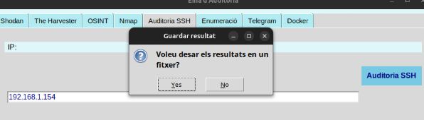

# Projecte-M14
# Index
- Preparació
  - [Anàlisi de riscos](#anàlisi-de-riscos)
- Fase de reconeixement
  - [Consulta API Shodan amb Python](#eina-api-de-shodan)
  - [The Harvester Python](#the-harvester)
  - [Més OSINT](#més-osint----infoga)

- Auditoria de serveis
  - [Escaneig](#escanneig)
  - [SSH](#ssh-audit)
  - [Enumeració](#enumeració)
- Funcionalitats afegides
  - [Bot Telegram amb Python](#bot-de-telegram)
  - [Crear un contenidor Docker](#contenidor-docker)
  
- Enllaç a la documentació tecnica
  - [Documentació tecnica](#documentació-tecnica)

# Preparació
## Anàlisi de Riscos
En aquest apartat realitzem un anàlisi dels següents elements: actius, amenaces, delimitació, probabilitat, impacte i risc. Això ens ajudarà a saber els objectius i les prioritats de la nostra auditoria, per a cada empresa.

### Document d'Anàlisi de Riscos

Aquest document definirà els registres, prioritats i classificacions de les iniciatives:

- Identificador: identifica cada cas.
- Títol: acció.
- Probabilitat: la probabilitat de que pase (Baix, Mitjà, Alt).
- Impacte: l’impacte que pot tenir sobre l’empresa (Baix, Mitjà, Alt).
  

[Enllaç al document d'anàlisi de riscos](https://docs.google.com/spreadsheets/d/1dkS1hjHjmgNUccRZiNJE737dglgypASPBg6EmL8X3DU/edit?usp=sharing)

# Aplicaió
La nostra aplicació funciona amb un client interactiu des d’una interfície gràfica, on es mostra un primer menú amb les tres part del projecte i dintre de cada una les diferents eines que podem executar:

# Fase de Reconeixement
## Shodan
El primer que hem de fer es impiortar l'eina de shodan. 

L'script te una funció principal on importem la nostra api de shodan que la hem obtingut una vegada ens hem registrat a la web.

#### Funció per a Shodan
El que fem amb aquesta funció es busca informació d'una adreça IP utilitzant l'API de Shodan, mostra els resultats en un widget de text i gestiona possibles errors que puguin produir-se durant la crida a l'API.

### Comprovació de funcionalitat de Shodan

## The Harvester
#### Codi

### Comprovació de funcionalitat de TheHarvester

## OSINT
Per a l'aparta de OSINT natros hem utilitzat les eines de WHOIS, DNS i NSLOOKUP

#### Codi per a WHOIS
Busquem la informació WHOIS d'un domini específic utilitzant el comandament whois, mostrem els resultats en un widget de text i gestionem possibles errors que puguin produir-se durant l'execució del comandament.

#### Codi per a DNS
Busquem la informació DNS d'un domini específic utilitzant el comandament dig, mostrem els resultats en un widget de text i gestiona possibles error.

#### Codi per a NSLOOKUP
Busquem la informació dels serveis de noms (NS) d'un domini específic utilitzant el comandament nslookup, mostrem els resultats en un widget de text i gestiona possibles error.

### Comprovació de funcionalitat de OSINT

#### WHOIS

#### DNS

#### NSLOOKUP

# Auditoria de Serveis
## Escaneig
### Codi
Aquesta funció realitza diferents tipus d'escanejos de xarxa mitjançant la biblioteca nmap, depenent de l'opció especificada, i mostra els resultats en un widget de text.

### Comprovació de funcionalitat d'escaieng
#### Descobrir Hosts de Xarxa

#### Escaneig de ports oberts

#### Serveis i versions

#### Vulnerabilitats

## SSH Audit
El primer que fem es accedir a l'enllaç de GitHub que hi ha al moodle i descarregem el zip d'SSH Audit

Una vegda descarregat i descomprimit mourem el fitxer ssh-audit.py a la carpeta de on tenim el codi del projecte.
 

### Codi
Realitzem una auditoria de seguretat SSH en una adreça IP específica utilitzant l'script ssh-audit.py, mostrant els resultats en un widget de text i gestionat possibles errors que puguin produir-se
 

#### Comprovació
 
 
 
 

## Enum4linux

# Enllaç a la documentació tecnica
## Documentació tecnica
[Enllaç Documentació tecnica](https://docs.google.com/document/d/1RJuZT7iGfF3JmYe5F83f2J6hP29RNNS_z-rVkVAYCM0/edit?usp=sharing)
